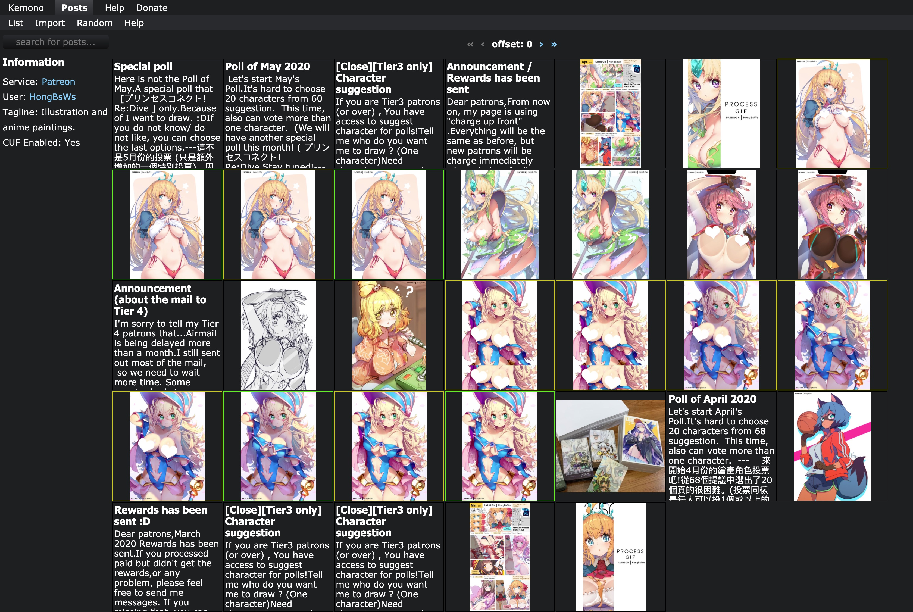

[Kemono](https://kemono.party) is an open-source reimplementation of [yiff.party](https://yiff.party/). It archives and dumps data, images, and files from paysites like Patreon.

Kemono's architecture consists of both importers to handle API data and a frontend to share it. While the status of the project is considered stable, there may be bugs and weird quirks here and there. Beware!

### Supported Sites
- Patreon
- Gumroad
- Discord

**Experimental/Unfinished**

- SubscribeStar
- Pixiv Fanbox

### Prerequisites
- Node v8.x
  - Other versions will cause issues.
- Yarn
- MongoDB

### Running
- [Download the latest release.](https://github.com/OpenYiff/Kemono/releases/latest)
- Install dependencies (`yarn`)
- Copy `.env.example` to `.env` and configure
- Start the development server. (`yarn run dev`) 

Your instance should now be running [here](http://localhost:8000).

**Where did the test scripts go?** The importer test scripts were removed in [v1.2](https://github.com/OpenYiff/Kemono/releases/tag/v1.2).

### Legal
[Licensed under BSD 3-Clause.](/LICENSE) [tldr.](https://www.tldrlegal.com/l/bsd3)

Kemono itself does not circumvent any technological copyright measures. Content is retrieved legally.
